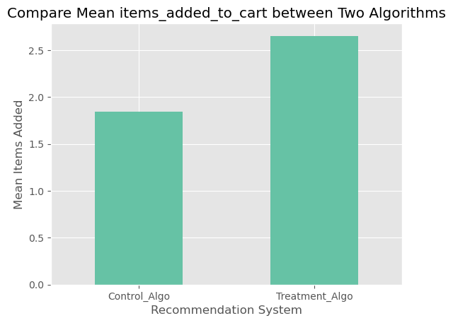
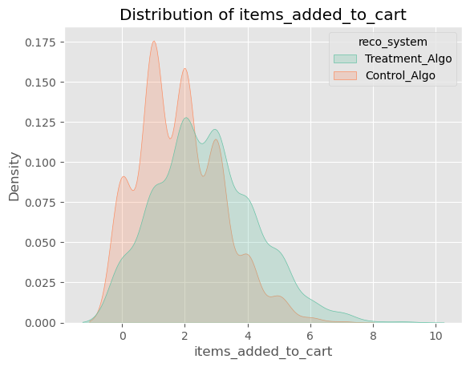
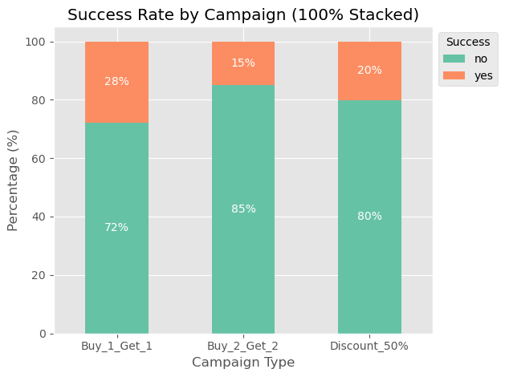

# 🛒 Online Shopping A/B Testing: Statistical Analysis & Business Impact

## Project Overview
* **Objective:** My goal is to see if a new recommendation system, a button color change, and different marketing campaigns actually work. This helps the team launch features that truly increase sales and conversions.
* **Hypothesis Testing & Results:** I used strong statistical tests (Brunner-Munzel, Z-Test, Chi-Square) and power analysis to measure the real impact (effect size) across three separate experiments. The results clearly showed which changes successfully drove more sales and conversions.

## Objective
My goal for this project was to build a strong statistical testing process for our e-commerce website. Instead of just guessing if a new feature 'works', I focused on the **Value Created**. I made sure that our choices are backed by real data and clear results. By correctly measuring the impact on money and conversions, I help the business focus on changes that bring the best results, rather than changes that only look good by chance.

## Resources Used
* **Data Source:** [Online Shopping Hypothesis Testing](https://www.kaggle.com/datasets/sakdaphoda/online-shopping-hypothesis-testing)
* **Languages:** Python
* **Libraries & Packages:** `pandas`, `numpy`, `matplotlib`, `seaborn`, `kagglehub`, `pingouin`, `scipy`, `statsmodels`, `itertools`

## Project Features Explanation
This project uses three separate datasets. Here are the features for each:

**Button Color Test Dataset:**
* `session_id`: Unique ID for each user's browsing session.
* `button_color`: Shows if the user saw the `Old_Color` or the `New_Color` button.
* `converted`: Shows if the user completed an action, like making a purchase (1 for yes, 0 for no).

**Campaign Promo Test Dataset:**
* `customer_id`: Unique ID for each customer.
* `campaign_type`: The specific marketing campaign the customer received (like `Discount_50%`, `Buy_1_Get_1`).
* `campaign_success`: Shows if the campaign successfully led to an action (1 for yes, 0 for no).

**Recommendation System Test Dataset:**
* `customer_id`: Unique ID for each customer.
* `reco_system`: Shows which recommendation algorithm the customer saw (`Control_Algo` or `Treatment_Algo`).
* `items_added_to_cart`: The total number of items the customer added to their shopping cart.
* `sales`: The total money made from the customer.

## Hypothesis Testing & Results
Because this is an A/B testing project, my work focused on doing strong statistical tests and measuring the real impact. The tests and their results are broken down below:

### 1. Recommendation System (Algorithm Test)
* **Methodology:** First, I checked if the `items_added_to_cart` data was normal using `pingouin`. Since it was not, I used the Brunner-Munzel test. I also checked the effect size (Cohen's d) and made sure my data size was big enough for reliable results.
* **Results:** The Brunner-Munzel test showed a real difference. I also estimated the expected increase in average sales per person. The new `Treatment_Algo` is the best choice to make more money.
  * **Sales Impact Summary:** The new algorithm increases average sales by **$97.12 /person**.
  * **95% Confidence Interval (Bootstrap):** Expected increase between **[$80.07 to $113.88] /person**.

### 2. UI/UX Optimization (Button Color)
* **Methodology:** For the button color test, I used a Z-Test to compare the conversion rates. I also measured the effect size (Cohen's h) to see if the change is actually useful for the business.
* **Results:** The Z-test showed that the conversion rates for the two buttons are very different. The new color significantly improved the conversion rate, meaning it is a better choice for driving sales.

### 3. Marketing Campaign Effectiveness (A/B/n Testing)
* **Methodology:** To compare many campaigns at the same time, I used a Chi-Square test. I measured the overall impact using Cramer's V and Cohen's W. I also did pairwise Z-tests to find out exactly which campaign was the best.
* **Results:** The Chi-Square tests showed real differences between some campaigns. This helped me find the best marketing strategies.
  * **Interpretation:**
    * Pair `Buy_1_Get_1` vs `Buy_2_Get_2` is significantly different.
    * Pair `Buy_1_Get_1` vs `Discount_50%` is significantly different.
    * Pair `Buy_2_Get_2` vs `Discount_50%` has no significant difference.

